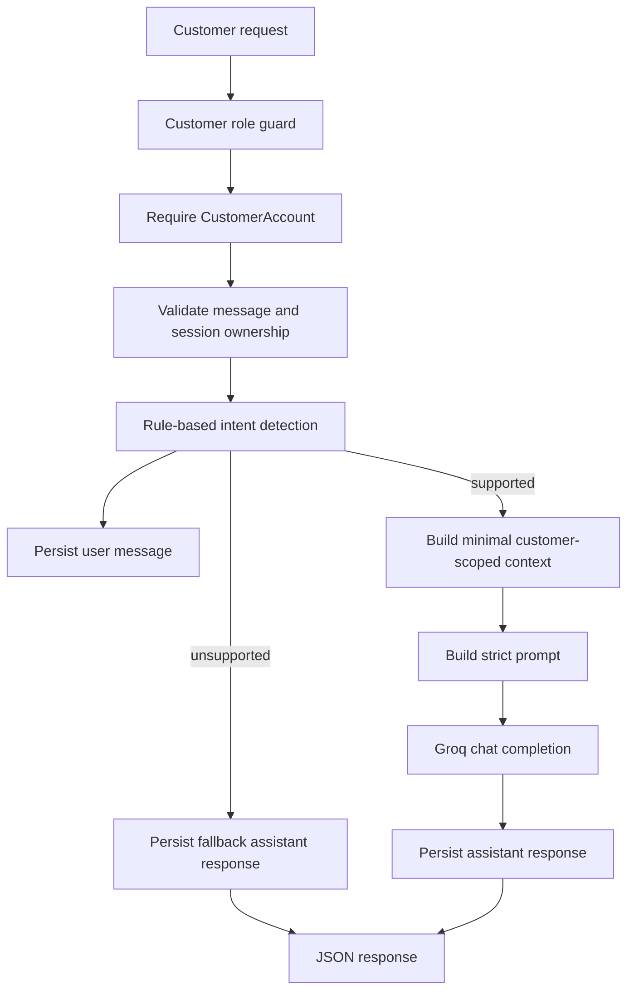

# Chatbot Phase 2 Backend Plan

## Scope
Implement Phase 2 of [`Overview and Plans/Plans/03-ai-customer-chatbot-plan.md`](Overview%20and%20Plans/Plans/03-ai-customer-chatbot-plan.md): deterministic backend chat behavior on top of the Phase 1 `ChatSession` / `ChatMessage` models. Keep Phase 3 UI polish out of scope, but add a minimal template or response path if needed so `GET /chatbot/` can render successfully.

## Backend Flow


## Files To Create
- [`DigicelAssessment/chatbot/intents.py`](DigicelAssessment/chatbot/intents.py): keyword-based intent detection for `current_plan`, `account_balance`, `data_usage`, `open_complaints`, `last_payment`, `active_outages`, and `unsupported`.
- [`DigicelAssessment/chatbot/context.py`](DigicelAssessment/chatbot/context.py): context builders that query only records belonging to the authenticated customer's [`CustomerAccount`](DigicelAssessment/customers/models.py).
- [`DigicelAssessment/chatbot/prompts.py`](DigicelAssessment/chatbot/prompts.py): strict system/user prompt builders and recent conversation formatter.
- [`DigicelAssessment/chatbot/groq_client.py`](DigicelAssessment/chatbot/groq_client.py): small Groq SDK wrapper using `Groq(api_key=settings.GROQ_API_KEY, timeout=...)`, low temperature, max token cap, and friendly custom exceptions.
- [`DigicelAssessment/chatbot/views.py`](DigicelAssessment/chatbot/views.py): customer-only page, message endpoint, and new-session endpoint.
- [`DigicelAssessment/chatbot/urls.py`](DigicelAssessment/chatbot/urls.py): `GET /chatbot/`, `POST /chatbot/messages/`, `POST /chatbot/sessions/new/`.
- Optional minimal [`DigicelAssessment/templates/chatbot/chat.html`](DigicelAssessment/templates/chatbot/chat.html): enough for Phase 2 `GET /chatbot/` to render existing messages; Phase 3 will replace/polish the UI.

## Files To Update
- [`DigicelAssessment/config/settings.py`](DigicelAssessment/config/settings.py): expose `GROQ_API_KEY`, plus conservative settings like `GROQ_MODEL = "llama-3.1-8b-instant"`, `GROQ_TIMEOUT_SECONDS`, and `CHATBOT_MESSAGE_MAX_LENGTH = 1000`.
- [`DigicelAssessment/config/urls.py`](DigicelAssessment/config/urls.py): include `chatbot.urls`.
- [`DigicelAssessment/templates/base.html`](DigicelAssessment/templates/base.html): change the disabled customer `Chatbot` nav item to a real link after backend routes exist.
- [`DigicelAssessment/chatbot/tests.py`](DigicelAssessment/chatbot/tests.py): extend Phase 1 model tests with intent, context, prompt, Groq-wrapper mocking, access control, JSON endpoint, session ownership, and persistence tests.
- [`DigicelAssessment/README.md`](DigicelAssessment/README.md): document Phase 2 routes, `GROQ_API_KEY`, local test commands, and expected unsupported/failure behavior.

## Implementation Steps
1. Add chatbot settings in [`config/settings.py`](DigicelAssessment/config/settings.py), reading `GROQ_API_KEY` from `.env` without ever storing it in the DB.
2. Implement [`chatbot/intents.py`](DigicelAssessment/chatbot/intents.py) with normalized keyword matching and a small `SUPPORTED_INTENTS` set; unsupported input must not call Groq.
3. Implement [`chatbot/context.py`](DigicelAssessment/chatbot/context.py) around [`customers.services.get_customer_account_for_user`](DigicelAssessment/customers/services.py), [`customers.models`](DigicelAssessment/customers/models.py), [`complaints.models.Complaint`](DigicelAssessment/complaints/models.py), and [`network.models.NetworkOutage`](DigicelAssessment/network/models.py). Context objects should include only minimal fields needed by the detected intent.
4. Implement [`chatbot/prompts.py`](DigicelAssessment/chatbot/prompts.py) with a strict system prompt, JSON-safe context rendering, and a recent transcript formatter limited to the latest few visible `ChatMessage` rows.
5. Implement [`chatbot/groq_client.py`](DigicelAssessment/chatbot/groq_client.py) using the current Groq Python SDK pattern: `client.chat.completions.create(...)`, `model=settings.GROQ_MODEL`, `temperature=0.1`, timeout configured on the client, and catches for `APIConnectionError`, `RateLimitError`, and `APIStatusError`.
6. Implement [`chatbot/views.py`](DigicelAssessment/chatbot/views.py) with `@role_required(UserProfile.Role.CUSTOMER)` and `@require_http_methods` / `@require_POST`; add helpers for account validation, latest-session lookup, session ownership, message validation, unsupported fallback, and error-to-JSON responses.
7. Add [`chatbot/urls.py`](DigicelAssessment/chatbot/urls.py) and include it in [`config/urls.py`](DigicelAssessment/config/urls.py) so the planned routes resolve.
8. Add a minimal [`templates/chatbot/chat.html`](DigicelAssessment/templates/chatbot/chat.html) or otherwise keep `GET /chatbot/` backend-valid with existing messages; leave async styling and suggested-question UI for Phase 3.
9. Update [`templates/base.html`](DigicelAssessment/templates/base.html) so customers see an enabled `Chatbot` link; agents/admins should still not see it.
10. Expand tests in [`chatbot/tests.py`](DigicelAssessment/chatbot/tests.py) to cover supported intents, unsupported fallback, customer-only access, account-required behavior, session ownership protection, context scoping, message persistence, and mocked Groq success/failure paths.

## Key Guardrails
- Never ask the LLM what to query; intent detection chooses the data path.
- Never pass passwords, internal complaint notes, other customers' complaints, whole model objects, or raw prompt payloads to Groq.
- Unsupported questions return the deterministic fallback directly without a Groq request.
- Missing `GROQ_API_KEY` returns a friendly setup error for supported intents while still preserving the user's message and a safe assistant response.
- Agent/admin users receive `403` via existing [`accounts.decorators.role_required`](DigicelAssessment/accounts/decorators.py).

## Verification
Run from [`DigicelAssessment/`](DigicelAssessment/):

```bash
python manage.py check
python manage.py test chatbot
python manage.py test complaints dashboard chatbot
```

Manual smoke checks after migrations and seed data:

```bash
# customer1 should load the page and POST messages
GET /chatbot/
POST /chatbot/messages/ {"message": "What plan am I currently on?"}
POST /chatbot/messages/ {"message": "Can you guess my neighbor's balance?"}

# agent/admin should be blocked
GET /chatbot/ as agent1 -> 403
```

## Acceptance Criteria
- Customer can load `/chatbot/`, create a new session, and send messages through `/chatbot/messages/`.
- Messages and assistant responses are persisted in `ChatMessage` with detected `intent`.
- Each supported example question maps to the correct deterministic intent.
- Context builders return only the authenticated customer's plan, balance, usage, payment, complaint, or outage data.
- Groq receives only minimal context plus strict prompt instructions.
- Unsupported, missing-key, invalid-input, invalid-session, and Groq-error cases return safe customer-friendly responses.