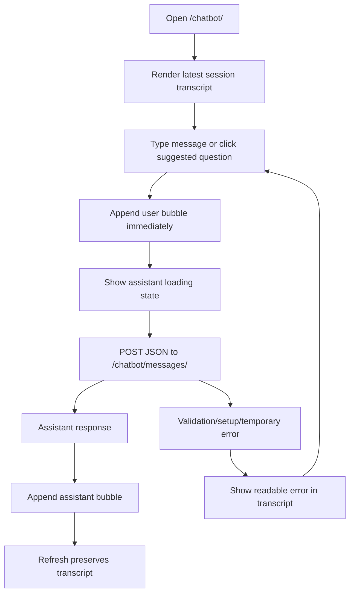

# Chatbot Phase 3 UI Plan

## Scope
Implement Phase 3 of [`Overview and Plans/Plans/03-ai-customer-chatbot-plan.md`](Overview%20and%20Plans/Plans/03-ai-customer-chatbot-plan.md): the customer-facing chat UI. Keep the existing Phase 2 backend endpoints and deterministic response contract intact:

- `GET /chatbot/`
- `POST /chatbot/messages/`
- `POST /chatbot/sessions/new/`

Do not expand chatbot knowledge or backend intents in this phase unless a tiny view context tweak is required for display.

## Current Starting Point
[`DigicelAssessment/templates/chatbot/chat.html`](DigicelAssessment/templates/chatbot/chat.html) already has a minimal transcript, textarea, send button, `fetch` calls, and new-session button. Phase 3 should replace that scaffold with a polished, maintainable Bootstrap UI and fix the rough edges in the current inline script.

[`DigicelAssessment/templates/base.html`](DigicelAssessment/templates/base.html) already shows a customer-only `Chatbot` nav link while agent/admin nav does not.

## Target UI Flow


## Files To Update
- [`DigicelAssessment/templates/chatbot/chat.html`](DigicelAssessment/templates/chatbot/chat.html): replace minimal markup/script with the final Bootstrap chat layout.
- [`DigicelAssessment/chatbot/views.py`](DigicelAssessment/chatbot/views.py): only add small display context values if needed, such as suggested questions, latest session label, or message counts.
- [`DigicelAssessment/templates/base.html`](DigicelAssessment/templates/base.html): verify customer nav stays enabled and agent/admin nav stays without chatbot link; optionally add active-state support if consistent with existing templates.
- [`DigicelAssessment/chatbot/tests.py`](DigicelAssessment/chatbot/tests.py): add light UI/rendering tests for the chat page, suggested question text, CSRF presence, and role access.
- [`DigicelAssessment/README.md`](DigicelAssessment/README.md): add Phase 3 UI notes and manual verification steps.

## Implementation Steps
1. Restructure [`templates/chatbot/chat.html`](DigicelAssessment/templates/chatbot/chat.html) into a two-column responsive Bootstrap layout:
   - Main chat card with transcript area, sticky input footer, loading/error area.
   - Side/help panel with supported question buttons and privacy/grounding note.
2. Render transcript messages as chat bubbles:
   - Customer messages aligned right with a “You” label.
   - Assistant messages aligned left with “Assistant” label.
   - Empty-state card for brand-new sessions.
   - Preserve existing chronological ordering from [`chatbot/views.py`](DigicelAssessment/chatbot/views.py).
3. Add suggested question buttons matching the plan exactly:
   - “What plan am I currently on?”
   - “What is my current account balance?”
   - “How much data have I used this month?”
   - “Do I have any open complaints?”
   - “When was my last payment made?”
   - “Are there outages affecting my area?”
4. Replace the current inline JavaScript with cleaner, defensive inline JS or a small [`DigicelAssessment/static/chatbot.js`](DigicelAssessment/static/chatbot.js) file. Prefer inline only if it stays readable. The script should:
   - Read CSRF token safely.
   - Submit via `fetch` to `chatbot:post_message`.
   - Disable send and suggested buttons while a request is pending.
   - Append the user message immediately.
   - Show “Assistant is thinking…” with spinner/typing state.
   - Append assistant replies without page navigation.
   - Render JSON validation/setup/upstream errors as readable chat alerts, never raw stack traces.
   - Clear the textarea after successful send.
   - Scroll transcript to the newest message.
5. Improve new-chat behavior:
   - POST to `chatbot:new_session`.
   - Clear the transcript immediately or refresh cleanly into the new session.
   - Show a readable error if session creation fails.
6. Keep backend enforcement unchanged:
   - `@role_required(UserProfile.Role.CUSTOMER)` in [`chatbot/views.py`](DigicelAssessment/chatbot/views.py) remains the source of truth.
   - Agents/admins should not see a chatbot nav link and should still receive `403` when manually visiting `/chatbot/`.
7. Add UI-focused tests in [`chatbot/tests.py`](DigicelAssessment/chatbot/tests.py):
   - Customer `GET /chatbot/` renders the chat page, send form, CSRF token, and suggested questions.
   - Existing messages appear in chronological order.
   - Agent/admin access remains blocked.
   - Missing account state renders the warning page.
   - The enabled customer nav link still resolves.
8. Update [`README.md`](DigicelAssessment/README.md) with Phase 3 manual verification steps, including supported questions, unsupported neighbor/balance prompt, refresh persistence, loading/error behavior, and agent block.

## Guardrails
- Keep account data display grounded in persisted `ChatMessage` content; do not expose raw prompt/context JSON in the UI.
- Do not show internal complaint notes or backend exception text.
- Do not add broad conversational scope or new unsupported backend intents.
- Keep the UI small enough for the assessment: Bootstrap + vanilla JS is sufficient.
- Preserve accessibility basics: labels, button states, `aria-live` for status/error messaging, and keyboard submit behavior.

## Verification
Run from [`DigicelAssessment/`](DigicelAssessment/):

```bash
python manage.py check
python manage.py test chatbot -v 2
```

Manual browser checks:

1. Log in as `customer1` and open `/chatbot/`.
2. Click each suggested question and confirm responses append without full-page navigation.
3. Type a custom supported question and confirm textarea clears after send.
4. Ask “Can you guess my neighbor’s balance?” and confirm the assistant refuses or says it lacks account information.
5. Refresh and confirm transcript persists.
6. Start a new chat and confirm the visible transcript resets/uses the new session.
7. Temporarily remove `GROQ_API_KEY` and confirm setup error is readable.
8. Log in as `agent1` and confirm `/chatbot/` returns `403` and no nav link appears.

## Acceptance Criteria
- Chat page is a polished Bootstrap interface rather than a minimal scaffold.
- Suggested questions are visible and usable.
- Send button, suggested buttons, and loading state behave correctly during requests.
- Success and error responses append to the transcript without page reload.
- Transcript persists after refresh because messages remain in PostgreSQL.
- Customer-only access is visible in nav and enforced by backend.