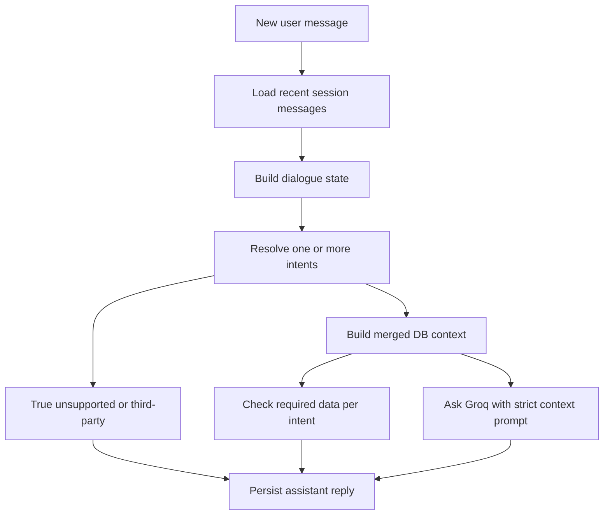

# Chatbot Workflow Refactor Plan

## Goal
Bring Module 2 closer to `ProjectDescription.md` by making chatbot answers use session history meaningfully, support follow-up and multi-part questions, and keep all answers grounded only in customer-scoped database context.

## Key Current Gap
The current `post_message` flow in [`DigicelAssessment/chatbot/views.py`](DigicelAssessment/chatbot/views.py) resolves one intent from the latest message, then returns `unsupported` before Groq when keyword detection fails. [`DigicelAssessment/chatbot/intents.py`](DigicelAssessment/chatbot/intents.py) is first-match and only has a narrow follow-up hint, so questions like “What about the data allowance on that?” or “And my balance?” can lose context.

## Architecture
Use a two-stage backend pipeline:



## Implementation Steps
1. Add a dialogue-state layer in [`DigicelAssessment/chatbot/intents.py`](DigicelAssessment/chatbot/intents.py):
   - Introduce a small dataclass such as `DialogueState(last_grounded_intent, recent_intents)`.
   - Build it from both user and assistant `ChatMessage.intent` values, skipping `unsupported` but not letting an unsupported turn erase the previous grounded topic.
   - Keep third-party terms like neighbor/friend/cousin as hard `unsupported` before any follow-up reuse.

2. Replace single-intent detection with deterministic multi-intent resolution:
   - Add `detect_intents(message, dialogue_state=None) -> list[str]` while keeping `detect_intent()` as a compatibility wrapper returning the primary intent.
   - Let multi-clause questions return stable ordered intent lists, e.g. `current_plan` + `account_balance`.
   - Add cautious follow-up/coreference rules for short or elliptical turns containing words like `that`, `it`, `same`, `also`, `break down`, `allowance`, `what about`, and `and my balance`.

3. Add merged context construction in [`DigicelAssessment/chatbot/context.py`](DigicelAssessment/chatbot/context.py):
   - Keep existing per-intent builders intact.
   - Add `build_merged_chat_context(user, intents, account=None)` returning a namespaced payload such as `{ "intents": [...], "sections": { "current_plan": {...}, "account_balance": {...} } }`.
   - Add `merged_context_has_required_data(intents, context)` that validates each resolved intent using existing `context_has_required_data` behavior.
   - Preserve privacy boundaries: complaint context still excludes descriptions/internal notes; no unrelated account/profile fields are added.

4. Refactor [`DigicelAssessment/chatbot/views.py`](DigicelAssessment/chatbot/views.py):
   - Replace `_recent_user_intent()` with the dialogue-state builder.
   - Store the primary resolved intent in existing `ChatMessage.intent` for backward compatibility; avoid model/migration changes unless a future analytics need appears.
   - Return the current JSON shape `{ ok, session_id, intent, message }`, optionally adding `intents` as a non-breaking field.
   - Only skip Groq for true unsupported/third-party, validation errors, missing required account data, or missing API key.

5. Strengthen prompts in [`DigicelAssessment/chatbot/prompts.py`](DigicelAssessment/chatbot/prompts.py):
   - Update the system prompt to explain namespaced multi-section context.
   - Tell the model to answer each requested part from its matching context section only.
   - Clarify `monthly_price` is plan subscription price and `current_balance` is amount owed/current account balance.
   - Keep the exact insufficient-information phrase for missing sections.

6. Keep [`DigicelAssessment/chatbot/groq_client.py`](DigicelAssessment/chatbot/groq_client.py) mostly unchanged:
   - Continue using one strict system prompt plus one user prompt with recent transcript embedded.
   - Do not switch to true multi-message Groq history in this pass unless tests show the prompt-only approach cannot satisfy follow-ups.
   - Ensure prompt size remains bounded by the existing recent-message limit and completion-token settings.

7. Expand tests in [`DigicelAssessment/chatbot/tests.py`](DigicelAssessment/chatbot/tests.py):
   - Unit-test multi-intent detection and primary-intent compatibility.
   - Test follow-up reuse after an initial grounded question.
   - Test follow-up after an unsupported turn still finds the previous grounded topic when safe.
   - Test third-party prompts still return `unsupported` and do not call Groq.
   - Test merged context contains only requested safe sections.
   - Mock `ask_groq` in API tests to assert it receives merged context for multi-part/follow-up requests.

8. Update [`DigicelAssessment/README.md`](DigicelAssessment/README.md):
   - Add “Follow-ups & multi-part questions” under Chatbot.
   - Document that `intent` remains primary and `intents` may list all resolved topics if added.
   - Add manual QA examples from the refactor prompt.

## Verification
Run from [`DigicelAssessment/`](DigicelAssessment/):

```bash
python manage.py check
python manage.py test chatbot -v 2
```

Manual smoke checks as `customer1`:
- “What plan am I currently on?” then “What about the data allowance on that?”
- “What is my current account balance and what plan am I on?”
- “Do I have any open complaints?” then “Can you break that down?”
- “Can you guess my neighbor’s balance?” confirms refusal and no Groq call for third-party scope.

## Non-Goals
- Do not add new business intents beyond the six required chatbot families.
- Do not change customer-only access or expose chatbot to agent/admin users.
- Do not replace the Phase 3 Bootstrap UI unless response JSON additions require a tiny display tweak.
- Do not add a schema migration unless explicitly deciding to persist all detected intents for analytics.