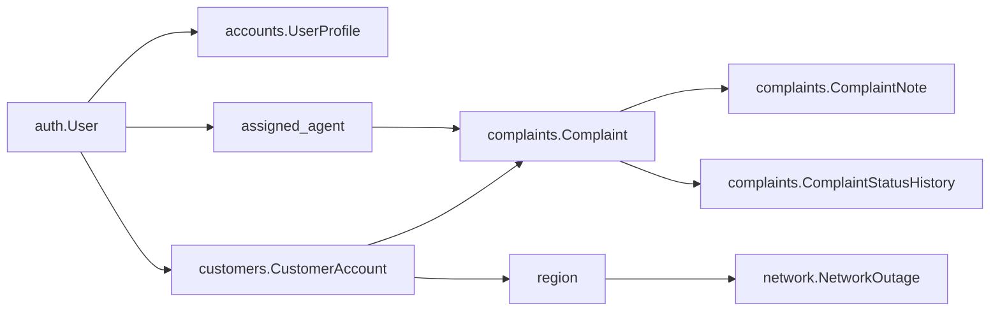

# Complaint Module Phase 1 Plan

## Scope
Implement only Phase 1 from `[Overview and Plans/Plans/02-complaint-and-fault-management-plan.md](c:\Users\Djackree\Desktop\Repos\DigicelAssessment\Overview and Plans\Plans\02-complaint-and-fault-management-plan.md)`: database setup, admin registration, migrations, and seed data. Do not modify the plan document itself.

## Target Project Paths
Work inside the nested Django project at `[DigicelAssessment](c:\Users\Djackree\Desktop\Repos\DigicelAssessment\DigicelAssessment)`.

Key existing anchors:

- `[DigicelAssessment/config/settings.py](c:\Users\Djackree\Desktop\Repos\DigicelAssessment\DigicelAssessment\config\settings.py)` currently registers `accounts`, `customers`, and `core` only.
- `[DigicelAssessment/customers/models.py](c:\Users\Djackree\Desktop\Repos\DigicelAssessment\DigicelAssessment\customers\models.py)` provides `CustomerAccount` with `region`, which complaints and outages will reference conceptually.
- `[DigicelAssessment/accounts/models.py](c:\Users\Djackree\Desktop\Repos\DigicelAssessment\DigicelAssessment\accounts\models.py)` provides `UserProfile.Role.AGENT` for seeded assignment targets.
- `[DigicelAssessment/core/management/commands/seed_data.py](c:\Users\Djackree\Desktop\Repos\DigicelAssessment\DigicelAssessment\core\management\commands\seed_data.py)` is the existing idempotent foundation seed command to extend.

## Implementation Steps

1. Add Django app scaffolding for `complaints`, `network`, and `dashboard` under `[DigicelAssessment](c:\Users\Djackree\Desktop\Repos\DigicelAssessment\DigicelAssessment)`.

   Create standard app files manually or with `startapp` if available: `apps.py`, `__init__.py`, `admin.py`, `models.py`, and `migrations/__init__.py`. The `dashboard` app can stay model-free in Phase 1, but should exist for Phase 2 services/views.

2. Register the new apps in `[DigicelAssessment/config/settings.py](c:\Users\Djackree\Desktop\Repos\DigicelAssessment\DigicelAssessment\config\settings.py)`.

   Add `complaints`, `network`, and `dashboard` to `INSTALLED_APPS` after the existing local apps.

3. Implement complaint database models in `[DigicelAssessment/complaints/models.py](c:\Users\Djackree\Desktop\Repos\DigicelAssessment\DigicelAssessment\complaints\models.py)`.

   Add:

   - `Complaint` with category/status `TextChoices`, unique indexed `reference`, FK to `customers.CustomerAccount`, optional `assigned_agent`, `escalation_reason`, `resolved_at`, and timestamps.
   - `ComplaintNote` with FK to `Complaint`, protected FK to `User`, `body`, `is_internal`, and `created_at`.
   - `ComplaintStatusHistory` with FK to `Complaint`, protected FK to `User`, `from_status`, `to_status`, `note`, and `created_at`.

   Include useful `Meta.indexes` for query patterns that Phase 2/3 will need: assigned queue, status/category filters, customer history, SLA checks, notes/history chronology.

4. Implement deterministic complaint reference generation.

   Add a small helper on the model layer, such as `generate_complaint_reference()`, that returns `CMP-YYYY-0001` style references based on the current year and latest matching complaint. Keep it simple and deterministic for the assessment. Set a missing `reference` automatically in `Complaint.save()` so seed data and later forms do not duplicate that logic.

5. Implement outage/fault model in `[DigicelAssessment/network/models.py](c:\Users\Djackree\Desktop\Repos\DigicelAssessment\DigicelAssessment\network\models.py)`.

   Add `NetworkOutage` with `region`, `title`, `description`, `started_at`, optional `estimated_resolution_at`, `is_active`, and timestamps. Index `region`, `is_active`, and a practical combined lookup like `is_active, region` for later chatbot/admin lookups.

6. Register admin views.

   In `[DigicelAssessment/complaints/admin.py](c:\Users\Djackree\Desktop\Repos\DigicelAssessment\DigicelAssessment\complaints\admin.py)`, register `Complaint`, `ComplaintNote`, and `ComplaintStatusHistory` with list displays, filters, search, date hierarchy, and autocomplete fields where supported.

   In `[DigicelAssessment/network/admin.py](c:\Users\Djackree\Desktop\Repos\DigicelAssessment\DigicelAssessment\network\admin.py)`, register `NetworkOutage` with filters for region/active status and searchable title/description.

7. Extend seed data in `[DigicelAssessment/core/management/commands/seed_data.py](c:\Users\Djackree\Desktop\Repos\DigicelAssessment\DigicelAssessment\core\management\commands\seed_data.py)`.

   Keep the existing `--if-empty` behavior intact. After foundation users/accounts are created, seed:

   - 15 complaints across all five categories and all five statuses.
   - Assigned and unassigned complaints, with assignments spread across `agent1`, `agent2`, and `agent3`.
   - At least 2 unresolved complaints older than 5 days to exercise SLA breach logic later.
   - Status history rows that match each seeded complaint's current status.
   - Internal notes on several assigned complaints.
   - At least 2 network outages, including 1 active outage matching a seeded customer region such as `Kingston`.

8. Generate and apply migrations.

   Run Django migrations from `[DigicelAssessment](c:\Users\Djackree\Desktop\Repos\DigicelAssessment\DigicelAssessment)`:

   ```bash
   python manage.py makemigrations complaints network dashboard
   python manage.py migrate
   ```

   If `dashboard` has no models, it may not generate a migration; that is acceptable.

9. Verify Phase 1 acceptance criteria.

   Run:

   ```bash
   python manage.py check
   python manage.py seed_data --if-empty
   ```

   If the local database is already seeded, verify against a reset test database or use Django shell read-only checks to confirm existing seeded rows. Confirm admin registration by starting the server and checking the Django admin, if runtime dependencies are available.

## Data Model Flow



## Acceptance Criteria

- `complaints`, `network`, and `dashboard` are installed Django apps.
- Complaint, note, status history, and outage migrations apply successfully.
- Admin site can browse/search complaint and outage records.
- Seed data includes complaint categories, statuses, assignments, status histories, internal notes, SLA breach examples, and active outage examples.
- Phase 2 can build services, permissions, and dashboard queries on top of these models without further schema redesign.