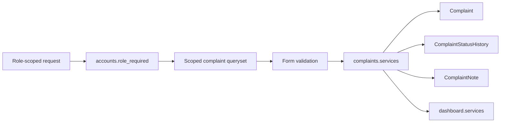

# Complaint Module Phase 2 Plan

## Scope
Implement only Phase 2 from `[Overview and Plans/Plans/02-complaint-and-fault-management-plan.md](c:\Users\Djackree\Desktop\Repos\DigicelAssessment\Overview and Plans\Plans\02-complaint-and-fault-management-plan.md)`: forms, services, permissions, routes, workflow validation, SLA logic, and dashboard queries. Do not edit the plan document itself and do not build the Phase 3 Bootstrap templates yet.

## Current Foundation
Use the existing nested Django project under `[DigicelAssessment](c:\Users\Djackree\Desktop\Repos\DigicelAssessment\DigicelAssessment)`.

Important existing pieces:

- `[DigicelAssessment/complaints/models.py](c:\Users\Djackree\Desktop\Repos\DigicelAssessment\DigicelAssessment\complaints\models.py)` already has `Complaint`, `ComplaintNote`, `ComplaintStatusHistory`, statuses/categories, reference generation, and indexes.
- `[DigicelAssessment/accounts/decorators.py](c:\Users\Djackree\Desktop\Repos\DigicelAssessment\DigicelAssessment\accounts\decorators.py)` already has `role_required`, `is_customer`, `is_agent`, and `is_admin`.
- `[DigicelAssessment/config/urls.py](c:\Users\Djackree\Desktop\Repos\DigicelAssessment\DigicelAssessment\config\urls.py)` currently includes only `accounts.urls` and Django admin.
- `[DigicelAssessment/accounts/urls.py](c:\Users\Djackree\Desktop\Repos\DigicelAssessment\DigicelAssessment\accounts\urls.py)` owns `/customer/`, `/agent/`, and `/admin-portal/` landing routes.

## Implementation Steps

1. Add complaint forms in `[DigicelAssessment/complaints/forms.py](c:\Users\Djackree\Desktop\Repos\DigicelAssessment\DigicelAssessment\complaints\forms.py)`.

   Create:

   - `ComplaintCreateForm` with `category` and `description`; validate a practical minimum description length.
   - `ComplaintStatusUpdateForm` with `status` and optional `note`; accept an `allowed_statuses` argument so agent options are restricted by workflow.
   - `ComplaintNoteForm` with required `body`.
   - `EscalationForm` with required `reason`.
   - `ComplaintAssignmentForm` with an agent queryset limited to users whose profile role is `agent`.
   - `AdminStatusOverrideForm` with all statuses and optional `note`.

   Keep Bootstrap widget classes light or reusable, but avoid relying on Phase 3 templates for correctness.

2. Add workflow and query services in `[DigicelAssessment/complaints/services.py](c:\Users\Djackree\Desktop\Repos\DigicelAssessment\DigicelAssessment\complaints\services.py)`.

   Centralize all complaint rules here:

   - `AGENT_FORWARD_TRANSITIONS` exactly matching the phase plan.
   - `get_customer_complaints(user)`, `get_agent_complaints(user)`, and `get_admin_complaints()` scoped query helpers.
   - `get_allowed_statuses(user, complaint)` using agent forward-only transitions and admin all-status access.
   - `change_complaint_status(...)` wrapped in `transaction.atomic()`, validating role/ownership, setting `resolved_at` when first entering `Resolved`, clearing it only if an admin moves away from resolved/closed if needed, creating `ComplaintStatusHistory`, and optionally creating a `ComplaintNote` for status notes.
   - `assign_complaint(...)` enforcing that the assignee has `UserProfile.Role.AGENT` and creating an audit history note.
   - `add_complaint_note(...)` enforcing agent/admin authors for internal notes.
   - `escalate_complaint(...)` requiring a reason, setting `escalation_reason`, and moving to `Escalated` via the same status service.
   - `get_sla_breaches()` returning unresolved/unclosed complaints older than five days.
   - `get_average_resolution_time()` based on `resolved_at - created_at` in Python for clarity.

3. Add dashboard metrics service in `[DigicelAssessment/dashboard/services.py](c:\Users\Djackree\Desktop\Repos\DigicelAssessment\DigicelAssessment\dashboard\services.py)`.

   Return a simple dict from `get_dashboard_metrics()` with:

   - `by_status`: counts for each `Complaint.Status` value, including zero-count statuses.
   - `by_category`: counts for each `Complaint.Category` value, including zero-count categories.
   - `average_resolution_time`: a display-friendly value or `None`.
   - `sla_breaches`: queryset/list from `complaints.services.get_sla_breaches()`.

4. Add complaint views in `[DigicelAssessment/complaints/views.py](c:\Users\Djackree\Desktop\Repos\DigicelAssessment\DigicelAssessment\complaints\views.py)`.

   Implement function-based views using `role_required` and scoped querysets before lookup:

   - Customer: `customer_complaint_list`, `customer_complaint_create`, `customer_complaint_detail`.
   - Agent: `agent_complaint_queue`, `agent_complaint_detail`, `agent_update_status`, `agent_add_note`, `agent_escalate`.
   - Admin: `admin_complaint_list`, `admin_complaint_detail`, `admin_assign_complaint`, `admin_update_status`.

   Use `get_object_or_404()` against the scoped queryset so inaccessible complaints return 404. Wrong-role routes remain 403 through `role_required`.

   Since Phase 3 owns templates, use minimal backend-safe responses for GET endpoints if templates are absent, or render to the future Phase 3 template names only after confirming those templates exist. POST endpoints should validate forms, call services, add Django messages, and redirect to the appropriate detail/list route.

5. Add complaint URLs in `[DigicelAssessment/complaints/urls.py](c:\Users\Djackree\Desktop\Repos\DigicelAssessment\DigicelAssessment\complaints\urls.py)`.

   Register `app_name = "complaints"` and add routes:

   - `/complaints/`, `/complaints/new/`, `/complaints/<reference>/`.
   - `/agent/complaints/`, `/agent/complaints/<reference>/`, `/agent/complaints/<reference>/status/`, `/agent/complaints/<reference>/notes/`, `/agent/complaints/<reference>/escalate/`.
   - `/admin-portal/complaints/`, `/admin-portal/complaints/<reference>/`, `/admin-portal/complaints/<reference>/assign/`, `/admin-portal/complaints/<reference>/status/`.

6. Add dashboard backend views/routes.

   In `[DigicelAssessment/dashboard/views.py](c:\Users\Djackree\Desktop\Repos\DigicelAssessment\DigicelAssessment\dashboard\views.py)`, add an admin-only dashboard view that calls `get_dashboard_metrics()`.

   In `[DigicelAssessment/dashboard/urls.py](c:\Users\Djackree\Desktop\Repos\DigicelAssessment\DigicelAssessment\dashboard\urls.py)`, register `/admin-portal/dashboard/` relative route.

   As with complaint GET views, keep output backend-safe until Phase 3 templates are added.

7. Wire URLs in `[DigicelAssessment/config/urls.py](c:\Users\Djackree\Desktop\Repos\DigicelAssessment\DigicelAssessment\config\urls.py)`.

   Include `complaints.urls` and `dashboard.urls` alongside existing account routes. Keep existing `/admin/` and account home/login/logout routes unchanged.

8. Add backend verification tests or shell checks.

   Prefer focused tests in `[DigicelAssessment/complaints/tests.py](c:\Users\Djackree\Desktop\Repos\DigicelAssessment\DigicelAssessment\complaints\tests.py)` and `[DigicelAssessment/dashboard/tests.py](c:\Users\Djackree\Desktop\Repos\DigicelAssessment\DigicelAssessment\dashboard\tests.py)` if time allows. Cover:

   - Customer querysets only return own complaints.
   - Agent querysets only return assigned complaints.
   - Agent cannot move backward or update unassigned complaints.
   - Escalation requires a reason.
   - Admin assignment requires an agent user.
   - Status changes create `ComplaintStatusHistory`.
   - SLA service finds old unresolved seeded-style complaints.
   - Dashboard metrics include status/category counts and breach list.

9. Run verification.

   From `[DigicelAssessment](c:\Users\Djackree\Desktop\Repos\DigicelAssessment\DigicelAssessment)` run:

   ```bash
   ./.venv/Scripts/python.exe manage.py check
   ./.venv/Scripts/python.exe manage.py test complaints dashboard
   ```

   If the DB seed is needed for manual checks, use a fresh database because the existing `seed_data --if-empty` skips once users exist.

## Backend Flow



## Acceptance Criteria

- Customer routes create complaints for the signed-in customer account and only expose that customer's complaints.
- Agent routes expose only assigned complaints, allow internal notes, enforce forward-only status transitions, and require escalation reasons.
- Admin routes expose all complaints, assign/reassign only valid agent users, and allow any valid status override.
- Every status change creates `ComplaintStatusHistory`; optional notes become internal `ComplaintNote` records.
- SLA and dashboard services return the required breach, status, category, and average-resolution metrics.
- `manage.py check` and focused tests pass without requiring Phase 3 templates.