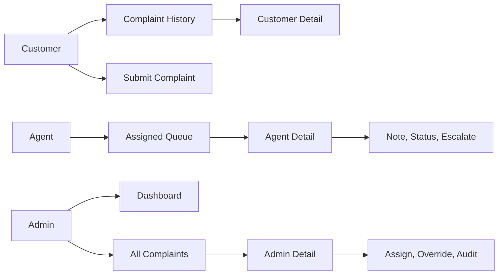

# Complaint Module Phase 3 Plan

## Scope
Implement only Phase 3 from `[Overview and Plans/Plans/02-complaint-and-fault-management-plan.md](c:\Users\Djackree\Desktop\Repos\DigicelAssessment\Overview and Plans\Plans\02-complaint-and-fault-management-plan.md)`: customer, agent, and admin complaint interfaces using Bootstrap templates, including admin dashboard and clear SLA display. Do not edit the original plan document.

Phase 2 already created functional templates and routes, so this phase should complete and polish the UI rather than rebuild it.

## Current UI Foundation
Existing files to build on:

- `[DigicelAssessment/templates/base.html](c:\Users\Djackree\Desktop\Repos\DigicelAssessment\DigicelAssessment\templates\base.html)` already has role-aware complaint/dashboard nav links.
- `[DigicelAssessment/templates/complaints/customer_list.html](c:\Users\Djackree\Desktop\Repos\DigicelAssessment\DigicelAssessment\templates\complaints\customer_list.html)`, `customer_form.html`, `customer_detail.html` already exist.
- `[DigicelAssessment/templates/complaints/agent_queue.html](c:\Users\Djackree\Desktop\Repos\DigicelAssessment\DigicelAssessment\templates\complaints\agent_queue.html)` and `agent_detail.html` already exist.
- `[DigicelAssessment/templates/complaints/admin_list.html](c:\Users\Djackree\Desktop\Repos\DigicelAssessment\DigicelAssessment\templates\complaints\admin_list.html)` and `admin_detail.html` already exist.
- `[DigicelAssessment/templates/dashboard/admin_dashboard.html](c:\Users\Djackree\Desktop\Repos\DigicelAssessment\DigicelAssessment\templates\dashboard\admin_dashboard.html)` already exists.
- `[DigicelAssessment/complaints/views.py](c:\Users\Djackree\Desktop\Repos\DigicelAssessment\DigicelAssessment\complaints\views.py)` and `[DigicelAssessment/dashboard/views.py](c:\Users\Djackree\Desktop\Repos\DigicelAssessment\DigicelAssessment\dashboard\views.py)` already provide context for these templates.

## Implementation Steps

1. Improve shared complaint UI patterns.

   Add consistent Bootstrap badges and formatting in the complaint templates:

   - Status badges for `Open`, `In Progress`, `Escalated`, `Resolved`, `Closed`.
   - Category badges or muted labels.
   - Short, consistent date formatting using Django template filters.
   - Better empty states and action buttons across customer/agent/admin lists.
   - Keep internal notes visually distinct and never reuse an internal-notes partial in customer templates.

   Prefer small duplicated snippets inside templates for now instead of introducing custom template tags unless duplication becomes distracting.

2. Complete customer pages.

   Update:

   - `[DigicelAssessment/templates/complaints/customer_list.html](c:\Users\Djackree\Desktop\Repos\DigicelAssessment\DigicelAssessment\templates\complaints\customer_list.html)`
   - `[DigicelAssessment/templates/complaints/customer_form.html](c:\Users\Djackree\Desktop\Repos\DigicelAssessment\DigicelAssessment\templates\complaints\customer_form.html)`
   - `[DigicelAssessment/templates/complaints/customer_detail.html](c:\Users\Djackree\Desktop\Repos\DigicelAssessment\DigicelAssessment\templates\complaints\customer_detail.html)`

   Ensure the customer UI includes:

   - Complaint list columns: reference, category, status, submitted date, last updated.
   - A prominent “Submit complaint” button.
   - Inline form errors for category and description.
   - Detail page with reference, category, description, status, submitted date, last updated.
   - Customer-visible status timeline only.
   - No internal notes, no status forms, no assignment controls.

3. Complete agent pages.

   Update:

   - `[DigicelAssessment/templates/complaints/agent_queue.html](c:\Users\Djackree\Desktop\Repos\DigicelAssessment\DigicelAssessment\templates\complaints\agent_queue.html)`
   - `[DigicelAssessment/templates/complaints/agent_detail.html](c:\Users\Djackree\Desktop\Repos\DigicelAssessment\DigicelAssessment\templates\complaints\agent_detail.html)`
   - `[DigicelAssessment/complaints/views.py](c:\Users\Djackree\Desktop\Repos\DigicelAssessment\DigicelAssessment\complaints\views.py)` if more display context is needed.

   Ensure the agent UI includes:

   - Assigned queue sorted oldest first.
   - Columns for reference, customer, category, status, age, SLA warning.
   - Optional GET filters by status/category if quick to add without complicating backend rules.
   - Detail page with customer/account summary, description, current status, internal notes, add-note form, allowed-next-status form, and escalation form.
   - Disable or hide escalation/status controls when the workflow state does not allow the action.

4. Complete admin complaint pages.

   Update:

   - `[DigicelAssessment/templates/complaints/admin_list.html](c:\Users\Djackree\Desktop\Repos\DigicelAssessment\DigicelAssessment\templates\complaints\admin_list.html)`
   - `[DigicelAssessment/templates/complaints/admin_detail.html](c:\Users\Djackree\Desktop\Repos\DigicelAssessment\DigicelAssessment\templates\complaints\admin_detail.html)`
   - `[DigicelAssessment/complaints/views.py](c:\Users\Djackree\Desktop\Repos\DigicelAssessment\DigicelAssessment\complaints\views.py)` for filter context.

   Add or refine:

   - Admin list columns for reference, customer, category, status, assigned agent, created date, SLA indicator.
   - GET filters for status, category, agent, and SLA breach if straightforward.
   - Admin detail with full complaint info, assignment/reassignment form, status override form, internal notes, and status history.
   - A clear warning that admin overrides are audited.

5. Complete the admin dashboard.

   Update:

   - `[DigicelAssessment/templates/dashboard/admin_dashboard.html](c:\Users\Djackree\Desktop\Repos\DigicelAssessment\DigicelAssessment\templates\dashboard\admin_dashboard.html)`
   - `[DigicelAssessment/dashboard/views.py](c:\Users\Djackree\Desktop\Repos\DigicelAssessment\DigicelAssessment\dashboard\views.py)` if SLA age display needs precomputed context.

   Ensure dashboard includes:

   - Cards for total complaints by status using display labels, not just raw status values.
   - Table for totals by category using display labels.
   - Average resolution time card.
   - SLA breach table with reference, customer, category, age, assigned agent, and link to admin detail.
   - Breach list excludes resolved/closed complaints through existing service behavior.

6. Update role landing pages only if needed.

   Check:

   - `[DigicelAssessment/templates/accounts/landing_customer.html](c:\Users\Djackree\Desktop\Repos\DigicelAssessment\DigicelAssessment\templates\accounts\landing_customer.html)`
   - `[DigicelAssessment/templates/accounts/landing_agent.html](c:\Users\Djackree\Desktop\Repos\DigicelAssessment\DigicelAssessment\templates\accounts\landing_agent.html)`
   - `[DigicelAssessment/templates/accounts/landing_admin.html](c:\Users\Djackree\Desktop\Repos\DigicelAssessment\DigicelAssessment\templates\accounts\landing_admin.html)`

   Replace any remaining placeholder text with real links into complaint history, assigned queue, all complaints, and dashboard.

7. Verify UI and backend safety.

   Run checks from `[DigicelAssessment](c:\Users\Djackree\Desktop\Repos\DigicelAssessment\DigicelAssessment)`:

   ```bash
   ./.venv/Scripts/python.exe manage.py check
   ./.venv/Scripts/python.exe -m compileall complaints dashboard accounts -q
   ```

   If Postgres test DB creation is working locally, run:

   ```bash
   ./.venv/Scripts/python.exe manage.py test complaints dashboard
   ```

   Also do a browser pass with seeded users against a fresh database if possible:

   - `customer1`: submit a complaint, see success message, see it in history, confirm no internal notes/status controls.
   - `agent1`: view assigned queue, add note, move `Open` to `In Progress`, escalate with reason, confirm another agent’s complaint is inaccessible.
   - `admin`: view dashboard, all complaints, assign unassigned complaint to `agent2`, override status, confirm status history.
   - SLA: dashboard shows seeded breach rows and each row links to admin complaint detail.

## UI Flow



## Acceptance Criteria

- Customer pages satisfy the list/create/detail requirements and never expose internal notes or status controls.
- Agent pages show only assigned complaints, display SLA warnings, and expose only valid workflow actions.
- Admin pages show all complaints, dashboard metrics, SLA breaches, assignment/reassignment, override controls, internal notes, and full status history.
- Role navbar and landing pages link to the completed complaint/dashboard pages.
- `manage.py check` and template compilation pass; tests are run if the local Postgres test DB is available.