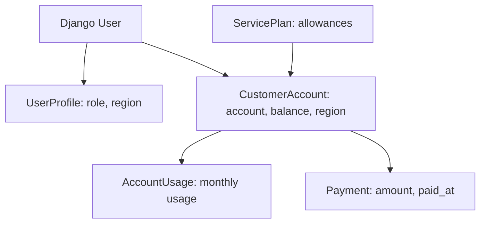

# Phase 1 System Architecture Implementation Plan

## Goal
Implement the database foundation described in [Plans/01-system-architecture-plan.md](Plans/01-system-architecture-plan.md). This phase should produce a Django project that can connect to PostgreSQL, define the foundation models, register them in admin, and provide a first-run seed command for users, roles, customer accounts, plans, usage, and payments.

## Scope
- Create the initial Django project and required apps because the repo currently only contains planning/docs.
- Configure PostgreSQL through environment variables.
- Add Docker Compose database service and `.env.example`.
- Implement `accounts.UserProfile`.
- Implement `customers.ServicePlan`, `CustomerAccount`, `AccountUsage`, and `Payment`.
- Add admin registration for foundation models.
- Add initial migrations.
- Add `seed_data --if-empty` with foundation seed data only.

Complaint, outage, dashboard, auth views, Bootstrap templates, and chatbot behavior should wait for later phases/plans.

## Files To Create Or Update
- [requirements.txt](requirements.txt): Django, PostgreSQL driver, Groq dependency placeholder for later.
- [manage.py](manage.py): Django project entrypoint.
- [config/settings.py](config/settings.py): installed apps, PostgreSQL env config, timezone/static basics.
- [config/urls.py](config/urls.py): admin route only for Phase 1.
- [docker-compose.yml](docker-compose.yml): PostgreSQL `db` service and persistent volume.
- [.env.example](.env.example): documented environment variables.
- [accounts/models.py](accounts/models.py): `UserProfile` role model.
- [accounts/admin.py](accounts/admin.py): `UserProfile` admin registration.
- [customers/models.py](customers/models.py): plan/account/usage/payment models.
- [customers/admin.py](customers/admin.py): customer model admin registrations.
- [core/management/commands/seed_data.py](core/management/commands/seed_data.py): idempotent foundation seeding.

## Implementation Steps
1. Bootstrap Django project structure with `config`, `accounts`, `customers`, and `core` apps.
2. Add dependencies in `requirements.txt`, using Django and `psycopg[binary]`; include `groq` now only because it is part of the final assessment stack.
3. Configure `INSTALLED_APPS` with Django defaults plus `accounts`, `customers`, and `core`.
4. Configure PostgreSQL in `config/settings.py` from `POSTGRES_*` env vars, matching the plan’s required names.
5. Add `.env.example` with `DJANGO_SECRET_KEY`, `DJANGO_DEBUG`, `DJANGO_ALLOWED_HOSTS`, `POSTGRES_DB`, `POSTGRES_USER`, `POSTGRES_PASSWORD`, `POSTGRES_HOST`, `POSTGRES_PORT`, and `GROQ_API_KEY`.
6. Add `docker-compose.yml` with a `postgres:16` `db` service, env interpolation, `5432:5432`, and `postgres_data` volume.
7. Implement `UserProfile` with `Customer`, `Agent`, and `Admin` role choices, `user` one-to-one relation, optional `region`, and timestamps.
8. Implement customer foundation models: `ServicePlan`, `CustomerAccount`, `AccountUsage`, and `Payment`, preserving the field choices and indexes from the architecture plan.
9. Register models in Django admin with useful list display/search/filter fields.
10. Create migrations for `accounts` and `customers`.
11. Implement `seed_data --if-empty` to create 1 admin, 3 agents, 5 customers, profiles, 3 plans, 5 accounts, current usage records, and at least one payment per customer.
12. Run migration and seed verification locally against PostgreSQL.

## Data Model Notes

## Acceptance Criteria
- PostgreSQL starts from Docker Compose.
- Django settings connect to PostgreSQL through `.env` values.
- Migrations exist and apply for `accounts` and `customers`.
- Admin can inspect `UserProfile`, `ServicePlan`, `CustomerAccount`, `AccountUsage`, and `Payment`.
- `python manage.py seed_data --if-empty` creates the foundation demo data once and skips on subsequent runs.
- Seeded users include deterministic admin, agent, and customer credentials suitable for README documentation later.
- No `.env` or secrets are committed.

## Verification
- Install dependencies and confirm `python manage.py check` passes.
- Run `python manage.py makemigrations` and `python manage.py migrate`.
- Run `python manage.py seed_data --if-empty` twice and confirm the second run does not duplicate records.
- Start PostgreSQL with Docker Compose and verify Django connects to `db` when using container settings.
- Log into Django admin with the seeded admin and confirm foundation records are present.

## Risks And Notes
- Because the repo currently lacks Django source files, this phase includes minimal project scaffolding required to make database setup possible.
- Docker web service and entrypoint automation are mainly Phase 2, but `docker-compose.yml` should include the `db` service now.
- Keep seed data limited to foundation records; complaint and outage seed records belong in `Plans/02-complaint-and-fault-management-plan.md`.