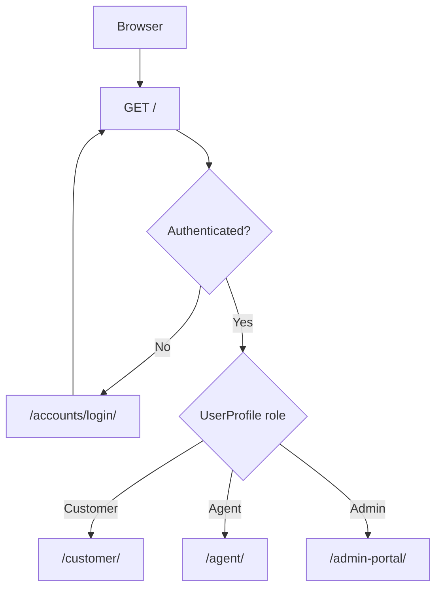

# Phase 2 System Architecture Implementation Plan

## Goal
Implement Phase 2 from [Plans/01-system-architecture-plan.md](Plans/01-system-architecture-plan.md): complete the backend foundation on top of Phase 1 by adding Docker web runtime, entrypoint automation, authentication routes, role-aware redirects, role decorators, and placeholder protected landing views.

## Current Context
The Django project currently lives under [DigicelAssessment/](DigicelAssessment/) with [DigicelAssessment/manage.py](DigicelAssessment/manage.py), [DigicelAssessment/config/settings.py](DigicelAssessment/config/settings.py), and apps [DigicelAssessment/accounts/](DigicelAssessment/accounts/), [DigicelAssessment/customers/](DigicelAssessment/customers/), and [DigicelAssessment/core/](DigicelAssessment/core/). Phase 2 should target these paths and should not edit the plan file.

## Scope
- Add Docker web service support and a project startup entrypoint.
- Ensure startup waits for PostgreSQL, runs migrations, runs `seed_data --if-empty`, and starts Django at port 8000.
- Implement auth/backend routes for login, logout, role redirects, and placeholder role landing pages.
- Add reusable role helpers/decorators for Customer, Agent, and Admin.
- Add basic customer account service helper(s) for later modules.
- Keep UI templates for Phase 3; Phase 2 can return simple HTTP responses or render placeholders only if needed to verify routing.

## Files To Create Or Update
- [DigicelAssessment/Dockerfile](DigicelAssessment/Dockerfile): Python web image for Django.
- [DigicelAssessment/docker-compose.yml](DigicelAssessment/docker-compose.yml): add `web` service alongside existing/needed `db` service.
- [DigicelAssessment/entrypoint.sh](DigicelAssessment/entrypoint.sh): wait for DB, migrate, seed, runserver.
- [DigicelAssessment/config/settings.py](DigicelAssessment/config/settings.py): login URLs, app config references if needed, CSRF/trusted host adjustments if needed.
- [DigicelAssessment/config/urls.py](DigicelAssessment/config/urls.py): include `accounts.urls` and keep admin route.
- [DigicelAssessment/accounts/decorators.py](DigicelAssessment/accounts/decorators.py): role helpers and `role_required` decorator.
- [DigicelAssessment/accounts/views.py](DigicelAssessment/accounts/views.py): login/logout wiring, role redirect, placeholder role landing views.
- [DigicelAssessment/accounts/urls.py](DigicelAssessment/accounts/urls.py): foundation auth and landing routes.
- [DigicelAssessment/customers/services.py](DigicelAssessment/customers/services.py): helper to retrieve the current user's customer account.
- [DigicelAssessment/README.md](DigicelAssessment/README.md): update only if needed with Phase 2 Docker run instructions.

## Implementation Steps
1. Add [DigicelAssessment/Dockerfile](DigicelAssessment/Dockerfile) using a Python 3.12 slim image, `/app` workdir, `requirements.txt` install, source copy, and `entrypoint.sh` execution.
2. Add or update [DigicelAssessment/docker-compose.yml](DigicelAssessment/docker-compose.yml) to include:
   - `db` service with PostgreSQL 16 and `postgres_data` volume.
   - `web` service built from `.`, mounted source, port `8000:8000`, `env_file: .env`, and `depends_on: db`.
3. Add [DigicelAssessment/entrypoint.sh](DigicelAssessment/entrypoint.sh) that waits for `POSTGRES_HOST:POSTGRES_PORT`, then runs:
   ```bash
   python manage.py migrate --noinput
   python manage.py seed_data --if-empty
   python manage.py runserver 0.0.0.0:8000
   ```
4. Update [DigicelAssessment/config/settings.py](DigicelAssessment/config/settings.py) with `LOGIN_URL`, `LOGIN_REDIRECT_URL`, `LOGOUT_REDIRECT_URL`, and any Docker-safe host/CSRF settings needed for local Compose.
5. Create [DigicelAssessment/accounts/decorators.py](DigicelAssessment/accounts/decorators.py) with `is_customer`, `is_agent`, `is_admin`, and `role_required(*roles)`.
6. Implement [DigicelAssessment/accounts/views.py](DigicelAssessment/accounts/views.py):
   - `RoleAwareLoginView` or Django `LoginView` configuration.
   - `role_redirect_view` for `/`.
   - `customer_home`, `agent_home`, and `admin_home` placeholder protected views.
   - Graceful handling for authenticated users without `UserProfile` by returning 403 or redirecting admin users safely.
7. Create [DigicelAssessment/accounts/urls.py](DigicelAssessment/accounts/urls.py) with foundation routes:
   - `GET /`
   - `GET/POST /accounts/login/`
   - `POST /accounts/logout/`
   - `GET /customer/`
   - `GET /agent/`
   - `GET /admin-portal/`
8. Update [DigicelAssessment/config/urls.py](DigicelAssessment/config/urls.py) to include `accounts.urls` and keep `/admin/`.
9. Add [DigicelAssessment/customers/services.py](DigicelAssessment/customers/services.py) with `get_customer_account_for_user(user)` for later complaint/chatbot modules.
10. Verify with Django checks and Docker Compose once Python/Docker are available.

## Route Flow


## Acceptance Criteria
- `docker compose up --build` from [DigicelAssessment/](DigicelAssessment/) starts both `web` and `db`.
- The entrypoint waits for PostgreSQL, applies migrations, runs `seed_data --if-empty`, and starts Django on `http://localhost:8000`.
- `/accounts/login/` supports Django login.
- `/accounts/logout/` supports POST logout.
- `/` redirects authenticated users by `UserProfile.role`.
- `/customer/`, `/agent/`, and `/admin-portal/` require the matching role.
- Wrong-role users receive 403.
- Admin site remains reachable at `/admin/` for the seeded admin.
- No plan files are edited.

## Verification
- From [DigicelAssessment/](DigicelAssessment/), run `python manage.py check`.
- Run `python manage.py migrate` and `python manage.py seed_data --if-empty` if the DB is available.
- Run `docker compose up --build` and confirm startup logs show migrations and seed command.
- Log in as `customer1`, `agent1`, and `admin` and confirm each lands on the correct placeholder page.
- Manually try wrong-role URLs and confirm 403.

## Risks And Notes
- The project currently appears nested under [DigicelAssessment/](DigicelAssessment/); keep Phase 2 files there unless the project is intentionally moved later.
- On Windows, `entrypoint.sh` executable bits can be unreliable. Prefer `command: sh ./entrypoint.sh` in Compose to avoid permission issues.
- Phase 3 will replace placeholder responses with Bootstrap templates and navigation.