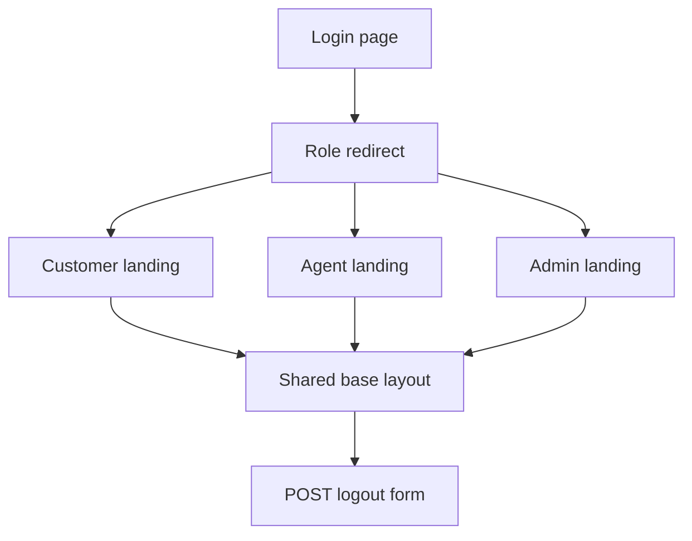

# Phase 3 System Architecture UI Implementation Plan

## Goal
Implement Phase 3 from [Overview and Plans/Plans/01-system-architecture-plan.md](Overview%20and%20Plans/Plans/01-system-architecture-plan.md): replace the Phase 2 placeholder HTML with a shared Bootstrap template foundation, role-aware navigation, login page, logout form, messages, and role-specific landing pages.

## Current Context
The Django app lives under [DigicelAssessment/](DigicelAssessment/). Phase 2 already added auth routes and placeholder views in [DigicelAssessment/accounts/views.py](DigicelAssessment/accounts/views.py), with templates at [DigicelAssessment/templates/accounts/login.html](DigicelAssessment/templates/accounts/login.html) and [DigicelAssessment/templates/accounts/role_home.html](DigicelAssessment/templates/accounts/role_home.html).

## Scope
- Add [DigicelAssessment/templates/base.html](DigicelAssessment/templates/base.html) with Bootstrap CDN, title block, role-aware nav, logout form, flash messages, and content block.
- Update login template to extend `base.html` and show form errors cleanly.
- Replace generic `role_home.html` with dedicated customer, agent, and admin landing templates.
- Update [DigicelAssessment/accounts/views.py](DigicelAssessment/accounts/views.py) to render the dedicated role landing templates.
- Keep complaint/dashboard/chatbot links as placeholders or future URLs that are visually present but do not require module implementation yet.
- Update [DigicelAssessment/README.md](DigicelAssessment/README.md) with Phase 3 UI run/verification notes if needed.

## Files To Create Or Update
- [DigicelAssessment/templates/base.html](DigicelAssessment/templates/base.html)
- [DigicelAssessment/templates/accounts/login.html](DigicelAssessment/templates/accounts/login.html)
- [DigicelAssessment/templates/accounts/landing_customer.html](DigicelAssessment/templates/accounts/landing_customer.html)
- [DigicelAssessment/templates/accounts/landing_agent.html](DigicelAssessment/templates/accounts/landing_agent.html)
- [DigicelAssessment/templates/accounts/landing_admin.html](DigicelAssessment/templates/accounts/landing_admin.html)
- [DigicelAssessment/accounts/views.py](DigicelAssessment/accounts/views.py)
- [DigicelAssessment/README.md](DigicelAssessment/README.md)

## Implementation Steps
1. Create `base.html` with Bootstrap CSS/JS CDN, ``, ``, and a responsive navbar.
2. In the navbar, show links based on `user.profile.role`:
   - Customer: Account, Complaints, New Complaint, Chatbot.
   - Agent: Assigned Complaints.
   - Admin: Dashboard, Complaints, Django Admin.
3. Include authenticated user identity and role in the navbar.
4. Add POST-only logout form in the navbar using `` and CSRF token.
5. Add flash message rendering for Django messages.
6. Update `login.html` to extend `base.html`, render username/password fields in Bootstrap form groups, and show non-field/field errors.
7. Create role-specific landing templates:
   - `landing_customer.html`: account summary placeholder and cards/links for complaints, new complaint, chatbot.
   - `landing_agent.html`: assigned queue placeholder and link/card for assigned complaints.
   - `landing_admin.html`: dashboard placeholder and links/cards for dashboard, all complaints, Django admin.
8. Update [DigicelAssessment/accounts/views.py](DigicelAssessment/accounts/views.py) so `customer_home`, `agent_home`, and `admin_home` render the dedicated landing templates instead of the generic `role_home.html` helper.
9. Keep URLs unchanged unless a route name adjustment is required; [DigicelAssessment/accounts/urls.py](DigicelAssessment/accounts/urls.py) should continue to expose `/`, `/accounts/login/`, `/accounts/logout/`, `/customer/`, `/agent/`, and `/admin-portal/`.
10. Optionally leave `role_home.html` unused or remove it if no references remain.
11. Run checks and manually verify role-specific UI behavior.

## UI Flow

## Acceptance Criteria
- Login page renders with Bootstrap and extends `base.html`.
- Failed login displays readable errors.
- Successful login redirects by role using existing Phase 2 logic.
- Navbar shows only links relevant to the current user's role.
- Authenticated user and role display in the navbar.
- Logout works through POST and redirects to login.
- Flash messages render consistently.
- Customer, agent, and admin landing pages render without complaint/chatbot/dashboard modules implemented.
- Wrong-role backend access remains protected by existing decorators.

## Verification
- Run `python manage.py check` from [DigicelAssessment/](DigicelAssessment/).
- Start the app with `docker compose up --build` or local `python manage.py runserver`.
- Log in as `admin`, confirm admin landing, Django Admin link, and no customer/agent nav links.
- Log out from the navbar.
- Log in as `agent1`, confirm agent landing and assigned complaints placeholder only.
- Log out from the navbar.
- Log in as `customer1`, confirm customer landing and account/complaint/chatbot placeholder links.
- Attempt a wrong-role URL, such as `/admin-portal/` as `customer1`, and confirm 403.

## Risks And Notes
- Avoid wiring placeholder links to unimplemented URLs unless guarded with `#` or clearly labeled as upcoming modules.
- Do not weaken backend role checks while adding role-aware navigation.
- Keep styling simple; detailed complaint/chatbot/dashboard UI belongs to later module plans.