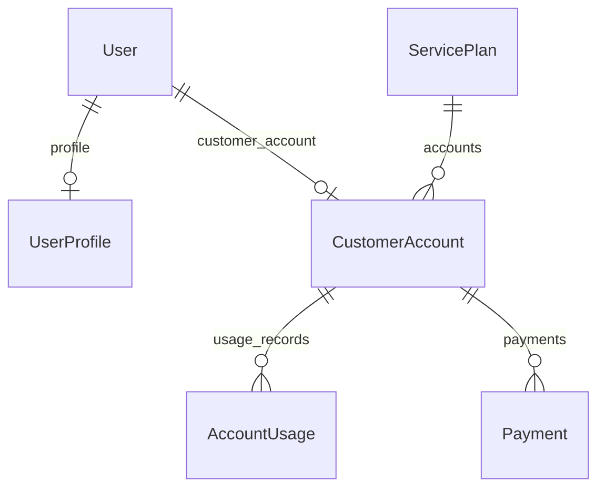

# Technical architecture

This document describes the **implemented** foundation of the Telecom Customer Portal (Phase 1) and how the pieces fit together. Deeper product and future-module design live under [`Plans/`](../Plans/).

## Repository layout

| Location | Role |
|----------|------|
| Repository root | `docker-compose.yml`, top-level [`README.md`](../README.md), [`Plans/`](../Plans/), [`Documentation/`](../Documentation/) |
| [`DigicelAssessment/`](../DigicelAssessment/) | Django project root (`manage.py`, `config/`, apps, `templates/`, `.env`) |
| [`DigicelAssessment/config/`](../DigicelAssessment/config/) | Settings, URL routing, WSGI/ASGI |
| [`DigicelAssessment/accounts/`](../DigicelAssessment/accounts/) | `UserProfile` and auth-related admin customization |
| [`DigicelAssessment/customers/`](../DigicelAssessment/customers/) | Service plans, accounts, usage, payments |
| [`DigicelAssessment/core/`](../DigicelAssessment/core/) | Cross-cutting app; management commands (e.g. `seed_data`) |

## Stack

- **Python / Django** — web framework and ORM.
- **PostgreSQL 16** — primary database (via Docker Compose at repo root).
- **python-dotenv** — loads [`DigicelAssessment/.env`](../DigicelAssessment/.env.example) into Django settings.
- **psycopg** — PostgreSQL driver for Django.
- **groq** — listed in [`requirements.txt`](../DigicelAssessment/requirements.txt) for a future chatbot phase (not wired in app code yet).

## Runtime entrypoint

Django CLI uses `DJANGO_SETTINGS_MODULE=config.settings`:

```8:12:DigicelAssessment/manage.py
def main():
    """Run administrative tasks."""
    os.environ.setdefault("DJANGO_SETTINGS_MODULE", "config.settings")
    try:
        from django.core.management import execute_from_command_line
```

## Configuration

### Environment loading

Settings load `.env` from the Django project directory (`DigicelAssessment/`):

```6:10:DigicelAssessment/config/settings.py
from dotenv import load_dotenv

BASE_DIR = Path(__file__).resolve().parent.parent

load_dotenv(BASE_DIR / ".env")
```

### Required environment variables

Template and documentation: [`DigicelAssessment/.env.example`](../DigicelAssessment/.env.example). Django reads `POSTGRES_*` (and other keys) from the process environment after `load_dotenv`.

Database configuration is PostgreSQL-only and secrets come from env:

```64:72:DigicelAssessment/config/settings.py
DATABASES = {
    "default": {
        "ENGINE": "django.db.backends.postgresql",
        "NAME": os.environ["POSTGRES_DB"],
        "USER": os.environ["POSTGRES_USER"],
        "PASSWORD": os.environ["POSTGRES_PASSWORD"],
        "HOST": os.environ.get("POSTGRES_HOST", "db"),
        "PORT": os.environ.get("POSTGRES_PORT", "5432"),
    }
}
```

- **`POSTGRES_HOST`**: `localhost` when Django runs on the host and Postgres is exposed from Docker; `db` when the web app runs in Compose on the same network as the DB (future Phase 2).

### Installed applications

Local apps `accounts`, `customers`, and `core` sit alongside Django contrib apps:

```23:33:DigicelAssessment/config/settings.py
INSTALLED_APPS = [
    "django.contrib.admin",
    "django.contrib.auth",
    "django.contrib.contenttypes",
    "django.contrib.sessions",
    "django.contrib.messages",
    "django.contrib.staticfiles",
    "accounts",
    "customers",
    "core",
]
```

Templates resolve from [`DigicelAssessment/templates/`](../DigicelAssessment/templates/) via `BASE_DIR / "templates"`.

## HTTP routing

Only the admin is mounted today:

```6:8:DigicelAssessment/config/urls.py
urlpatterns = [
    path("admin/", admin.site.urls),
]
```

Customer/agent dashboards, complaints, and chatbot URLs are specified in [`Plans/`](../Plans/) and are not implemented in this foundation snapshot.

## Docker Compose (database only)

From the repository root, Compose runs Postgres and injects DB credentials from the app `.env`:

```1:13:docker-compose.yml
# Run from repository root. Env vars for Postgres are read from the Django app folder.
services:
  db:
    image: postgres:16
    env_file:
      - ./DigicelAssessment/.env
    volumes:
      - postgres_data:/var/lib/postgresql/data
    ports:
      - "5432:5432"

volumes:
  postgres_data:
```

## Data model (implemented)

### Entity relationship (high level)



### `UserProfile`

One-to-one with Django `User`; stores **role** and optional **region** (used later for outages/chatbot context).

```5:19:DigicelAssessment/accounts/models.py
class UserProfile(models.Model):
    class Role(models.TextChoices):
        CUSTOMER = "customer", "Customer"
        AGENT = "agent", "Agent"
        ADMIN = "admin", "Admin"

    user = models.OneToOneField(
        User,
        on_delete=models.CASCADE,
        related_name="profile",
    )
    role = models.CharField(max_length=20, choices=Role.choices, db_index=True)
    region = models.CharField(max_length=100, blank=True)
    created_at = models.DateTimeField(auto_now_add=True)
    updated_at = models.DateTimeField(auto_now=True)
```

### `ServicePlan`

Catalog row for plan name, price, and allowances.

```5:11:DigicelAssessment/customers/models.py
class ServicePlan(models.Model):
    name = models.CharField(max_length=100, unique=True)
    monthly_price = models.DecimalField(max_digits=8, decimal_places=2)
    data_allowance_gb = models.DecimalField(max_digits=8, decimal_places=2)
    call_minutes = models.PositiveIntegerField()
    sms_allowance = models.PositiveIntegerField()
    created_at = models.DateTimeField(auto_now_add=True)
```

### `CustomerAccount`

Links a **customer** `User` to an `account_number`, `service_plan`, `current_balance`, and `region`.

```17:31:DigicelAssessment/customers/models.py
class CustomerAccount(models.Model):
    user = models.OneToOneField(
        User,
        on_delete=models.CASCADE,
        related_name="customer_account",
    )
    account_number = models.CharField(max_length=30, unique=True, db_index=True)
    service_plan = models.ForeignKey(
        ServicePlan,
        on_delete=models.PROTECT,
        related_name="accounts",
    )
    current_balance = models.DecimalField(max_digits=10, decimal_places=2)
    region = models.CharField(max_length=100, db_index=True)
```

`PROTECT` on `service_plan` prevents deleting a plan that still has accounts.

### `AccountUsage`

Monthly (or arbitrary) usage window per account; composite index for period lookups.

```38:54:DigicelAssessment/customers/models.py
class AccountUsage(models.Model):
    account = models.ForeignKey(
        CustomerAccount,
        on_delete=models.CASCADE,
        related_name="usage_records",
    )
    period_start = models.DateField()
    period_end = models.DateField()
    data_used_gb = models.DecimalField(max_digits=8, decimal_places=2)
    minutes_used = models.PositiveIntegerField(default=0)
    sms_used = models.PositiveIntegerField(default=0)
    created_at = models.DateTimeField(auto_now_add=True)

    class Meta:
        indexes = [
            models.Index(fields=["account", "period_start", "period_end"]),
        ]
```

### `Payment`

Payments with unique `reference` and indexed `paid_at` for “last payment” style queries.

```60:68:DigicelAssessment/customers/models.py
class Payment(models.Model):
    account = models.ForeignKey(
        CustomerAccount,
        on_delete=models.CASCADE,
        related_name="payments",
    )
    amount = models.DecimalField(max_digits=10, decimal_places=2)
    paid_at = models.DateTimeField(db_index=True)
    reference = models.CharField(max_length=50, unique=True)
```

### Migrations

- [`DigicelAssessment/accounts/migrations/0001_initial.py`](../DigicelAssessment/accounts/migrations/0001_initial.py) — `UserProfile`.
- [`DigicelAssessment/customers/migrations/0001_initial.py`](../DigicelAssessment/customers/migrations/0001_initial.py) — customer models + `AccountUsage` index.

## Django admin

`User` is re-registered with `search_fields` so `UserProfile` / `CustomerAccount` autocomplete works:

```8:25:DigicelAssessment/accounts/admin.py
@admin.register(UserProfile)
class UserProfileAdmin(admin.ModelAdmin):
    list_display = ("user", "role", "region", "updated_at")
    list_filter = ("role",)
    search_fields = ("user__username", "user__email", "region")
    autocomplete_fields = ("user",)

# Enable search for User autocomplete on CustomerAccount and UserProfile admins
try:
    admin.site.unregister(User)
except admin.sites.NotRegistered:
    pass


@admin.register(User)
class UserAdmin(BaseUserAdmin):
    search_fields = ("username", "email", "first_name", "last_name")
```

Customer-domain registrations: [`DigicelAssessment/customers/admin.py`](../DigicelAssessment/customers/admin.py).

## Seeding (`seed_data`)

Command: `python manage.py seed_data [--if-empty]`.

- **`--if-empty`**: if any `User` exists, exit without changes (safe for repeated runs / future Docker entrypoint).
- Without `--if-empty`, a non-empty DB raises `CommandError` to avoid accidental duplicate seed on a populated database.

```65:75:DigicelAssessment/core/management/commands/seed_data.py
        if User.objects.exists():
            if if_empty:
                self.stdout.write(self.style.WARNING("Skipping seed_data: database not empty."))
                return
            raise CommandError(
                "Database not empty. Re-run with --if-empty after reset, "
                "or clear users before seeding."
            )
```

Creation is wrapped in **`transaction.atomic()`**. Seed content includes three `ServicePlan` rows (Basic / Standard / Premium), one admin (staff + superuser), three agents, five customers with `UserProfile`, matching `CustomerAccount` / `AccountUsage` / `Payment` rows — see [`seed_data.py`](../DigicelAssessment/core/management/commands/seed_data.py) from line 82 onward.

## Security and secrets

- **Never commit** real [`DigicelAssessment/.env`](../DigicelAssessment/.env) (see [`.gitignore`](../.gitignore)).
- `DJANGO_SECRET_KEY` and `POSTGRES_PASSWORD` must be strong for anything beyond local dev.
- `DEBUG` should be `False` in production (not the focus of this assessment build).

## What is not in this codebase yet

Per [`Plans/01-system-architecture-plan.md`](../Plans/01-system-architecture-plan.md) and [`Project Overview/ProjectDescription.md`](../Project%20Overview/ProjectDescription.md), the following are **planned** but not present as application routes or models in the repo today:

- Role-based login redirects, Bootstrap base templates, customer/agent/admin UIs.
- Complaints, workflow, SLA dashboard, network outages (`Plans/02-…`).
- Chat sessions, Groq integration, intent + context pipeline (`Plans/03-…`).
- Full `docker-compose` **web** service, entrypoint migrations + auto-seed on first boot.

## Related documentation

- Command cheat sheet: [`Documentation/commands.md`](commands.md).
- Non-technical product view: [`Documentation/non-technical-overview.md`](non-technical-overview.md).
