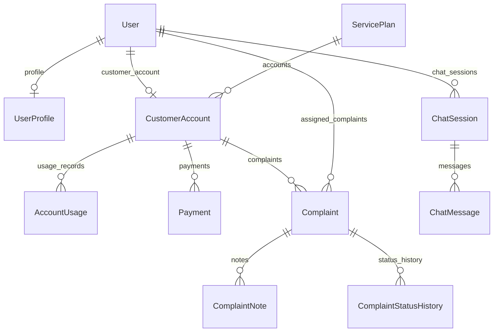

# Technical architecture

This document describes the **implemented** Telecom Customer Portal: Django apps, routing, persistence, the complaint workflow, admin dashboard metrics, and the Groq-backed chatbot. Product-friendly wording is in [`non-technical-overview.md`](non-technical-overview.md).

## Repository layout

| Location | Role |
|----------|------|
| Repository root | [`README.md`](../README.md), [`Documentation/`](../Documentation/), [`Overview and Plans/`](../Overview%20and%20Plans/) |
| [`DigicelAssessment/`](../DigicelAssessment/) | Django project (`manage.py`, `config/`, apps, `templates/`, `static/`, `Dockerfile`, [`docker-compose.yml`](../DigicelAssessment/docker-compose.yml), [`entrypoint.sh`](../DigicelAssessment/entrypoint.sh), `.env`) |

## Stack

- **Python 3.x / Django** — ORM, auth, admin, templates.
- **PostgreSQL 16** — primary database (`db` service in Compose).
- **Bootstrap** — UI via base templates under `templates/`.
- **python-dotenv** — loads [`DigicelAssessment/.env`](../DigicelAssessment/.env.example).
- **psycopg** — PostgreSQL adapter.
- **groq** — LLM client; model default `llama-3.1-8b-instant` (see `settings`).

## Runtime

### Django entry

`DJANGO_SETTINGS_MODULE=config.settings` (see `manage.py`).

### Configuration highlights

- **Database**: PostgreSQL only; `POSTGRES_*` from environment (after `load_dotenv` on `BASE_DIR / ".env"`).
- **Auth**: `LOGIN_URL` = `accounts:login`, post-login home `accounts:home` (role redirect).
- **CSRF**: `DJANGO_CSRF_TRUSTED_ORIGINS` (comma-separated), defaults include `http://localhost:8000`.
- **Chatbot** (env-backed):
  - `GROQ_API_KEY`, `GROQ_MODEL`, `GROQ_TIMEOUT_SECONDS`, `GROQ_MAX_COMPLETION_TOKENS`
  - `CHATBOT_MESSAGE_MAX_LENGTH`, `CHATBOT_RECENT_MESSAGE_COUNT`, `CHATBOT_DEFAULT_CURRENCY`

Full list: [`.env.example`](../DigicelAssessment/.env.example).

### Installed applications

Local apps: `accounts`, `customers`, `complaints`, `network`, `dashboard`, `chatbot`, `core`, plus Django contrib.

## HTTP routing

[`config/urls.py`](../DigicelAssessment/config/urls.py) mounts:

| Prefix / area | App | Purpose |
|---------------|-----|---------|
| `/admin/` | Django admin | Staff models CRUD |
| `accounts.urls` | `accounts` | Login/logout, role home, customer/agent/admin portal entry paths |
| `complaints.urls` | `complaints` | Customer complaint CRUD/list/detail; agent queue, notes, escalate, status; admin list/detail/assign/status |
| `dashboard.urls` | `dashboard` | Admin dashboard metrics |
| `chatbot.urls` | `chatbot` | Chat UI + JSON API for messages and sessions |

Representative routes (see each app’s `urls.py` for the full list):

- **Customer**: `/customer/`, `/complaints/`, `/complaints/new/`, `/complaints/<reference>/`, `/chatbot/`
- **Agent**: `/agent/`, `/agent/complaints/`, detail/update/notes/escalate under `/agent/complaints/<reference>/…`
- **Admin**: `/admin-portal/`, `/admin-portal/dashboard/`, `/admin-portal/complaints/…`

## Docker Compose

Compose file: [`DigicelAssessment/docker-compose.yml`](../DigicelAssessment/docker-compose.yml).

- **`db`**: PostgreSQL 16 with healthcheck (`pg_isready`).
- **`web`**: builds from [`Dockerfile`](../DigicelAssessment/Dockerfile), runs [`entrypoint.sh`](../DigicelAssessment/entrypoint.sh), overrides `POSTGRES_HOST=db`.

`entrypoint.sh` waits for Postgres, runs `migrate --noinput`, `seed_data --if-empty`, then `runserver 0.0.0.0:8000`.

## Data model (implemented)

### ER diagram (conceptual)

### Domain summary

| Model | App | Notes |
|-------|-----|------|
| `UserProfile` | `accounts` | Role (`customer` / `agent` / `admin`), `region` |
| `ServicePlan`, `CustomerAccount`, `AccountUsage`, `Payment` | `customers` | Account balances, plan, usage windows, payments |
| `Complaint`, `ComplaintNote`, `ComplaintStatusHistory` | `complaints` | Reference `CMP-YYYY-NNNN`, category, status, assignment, audit |
| `NetworkOutage` | `network` | Region, active flag, window for chatbot / future UI |
| `ChatSession`, `ChatMessage` | `chatbot` | Per-user sessions; messages store `role`, `content`, optional `intent` |

## Complaints workflow (code)

- **Statuses**: Open → In Progress → Escalated → Resolved → Closed (`complaints.models.Complaint.Status`).
- **Agents**: Allowed forward transitions only, and only on tickets **assigned** to them (`complaints.services.AGENT_FORWARD_TRANSITIONS`, `change_complaint_status`).
- **Admins**: Any status; assign agent (`assign_complaint`).
- **SLA**: `get_sla_breaches()` treats non-terminal complaints older than **five days** as breaches (`complaints.services`).
- **Notes**: `ComplaintNote.is_internal` — staff-only notes on agent/admin flows; customers do not see internal notes in templates.

## Admin dashboard

[`dashboard/services.py`](../DigicelAssessment/dashboard/services.py) aggregates:

- Counts by **status** and **category**
- **Average resolution time** (Open → Resolved) via `get_average_resolution_time()`
- **SLA breach** queryset for the table on the dashboard template

## Chatbot pipeline

High level:

1. **Access**: `chat_home` and POST endpoints require **customer** role (`@role_required(UserProfile.Role.CUSTOMER)`).
2. **Session**: `ChatSession` per user; list/create/select via `chatbot/views.py` and URLs under `chatbot/`.
3. **Intents**: `chatbot/intents.py` (`detect_intents`, `dialogue_state_from_messages`) drives which **context slices** to load.
4. **Context**: `chatbot/context.py` (`build_merged_chat_context`, `merged_context_has_required_data`) loads **only** relevant rows (account, usage, complaints, outages, plans, etc.).
5. **LLM**: `chatbot/groq_client.ask_groq` with `llama-3.1-8b-instant` by default; system guidance in `chatbot/prompts.py` to answer from context and admit missing data.
6. **Persistence**: User and assistant turns stored in `ChatMessage`; deterministic / error paths avoid hallucinating when API key missing or Groq errors (see `MISSING_API_KEY_REPLY`, etc. in `prompts.py`).

## Seeding

Command: `python manage.py seed_data [--if-empty]`.

- **`--if-empty`**: if any `User` exists, skip (idempotent Docker startup).
- Seeds admin, three agents, five customers, plans, accounts, usage, payments, **15 complaints** (mixed statuses/categories/agents), **two network outages**, per [`core/management/commands/seed_data.py`](../DigicelAssessment/core/management/commands/seed_data.py).

Default demo passwords are documented in the root [`README.md`](../README.md).

## Security and secrets

- Do not commit `DigicelAssessment/.env`.
- Production would set `DEBUG=False`, strong `DJANGO_SECRET_KEY`, HTTPS, and restrictive `ALLOWED_HOSTS` / `CSRF_TRUSTED_ORIGINS`.

## Related documentation

- Command reference: [`commands.md`](commands.md).
- Product overview: [`non-technical-overview.md`](non-technical-overview.md).
